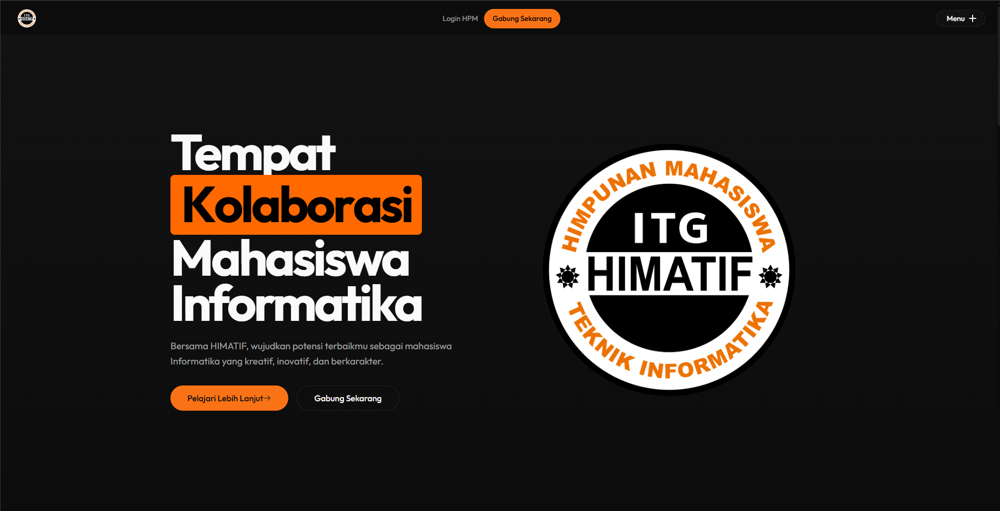

```
██████╗ ██╗  ██╗██╗███╗   ███╗ █████╗ ████████╗██╗███████╗
██╔══██╗██║  ██║██║████╗ ████║██╔══██╗╚══██╔══╝██║██╔════╝
██████╔╝███████║██║██╔████╔██║███████║   ██║   ██║█████╗
██╔══██╗██╔══██║██║██║╚██╔╝██║██╔══██║   ██║   ██║██╔══╝
██████╔╝██║  ██║██║██║ ╚═╝ ██║██║  ██║   ██║   ██║██║
╚═════╝ ╚═╝  ╚═╝╚═╝╚═╝     ╚═╝╚═╝  ╚═╝   ╚═╝   ╚═╝╚═╝
```

<p align="center">
  <strong>Himpunan Mahasiswa Teknik Informatika — Institut Teknologi Garut</strong>
  <br />
  Portal resmi HIMATIF ITG — Organisasi mahasiswa Teknik Informatika.
</p>

<p align="center">
  
  
  
  
  
  
  
</p>

---

## Table of Contents

- [Features](#features)
- [Tech Stack](#tech-stack)
- [Project Structure](#project-structure)
- [Quick Start](#quick-start)
- [Environment Variables](#environment-variables)
- [Screenshots](#screenshots)
- [License](#license)
- [Contact](#contact)

---

## Fitur

| | |
|---|---|
| Landing Page | Animasi interaktif dengan GSAP & Framer Motion |
| Berita & Artikel | Rich text editor dengan Tiptap |
| Manajemen Pengurus | Timeline sejarah kepemimpinan |
| Registrasi Anggota | Pendaftaran online dengan validasi |
| Admin Dashboard | CRUD untuk semua entitas |
| Auth & RBAC | JWT authentication + multi-level role |
| File Upload | Gambar berita & foto pengurus dengan Multer |
| Responsive | Mobile-first dengan Tailwind CSS |

---

## Tech Stack

### Frontend

| Teknologi | Deskripsi |
|---|---|
| React 19 | UI framework dengan Concurrent Features |
| TypeScript 6 | Type safety & developer experience |
| Vite 8 | Build tool super cepat |
| Tailwind CSS 4 | Utility-first styling |
| Framer Motion 12 | Animation library untuk React |
| GSAP 3 | High-performance animation |
| React Router 7 | Client-side routing |
| shadcn/ui | Accessible component library |
| Tiptap 3 | Rich text editor |
| Axios 1 | HTTP client |
| Phosphor Icons | SVG icon set |

### Backend

| Teknologi | Deskripsi |
|---|---|
| Node.js | JavaScript runtime |
| Express 5 | Web framework |
| MySQL2 | Database driver (connection pool) |
| JWT | Token-based authentication |
| Bcrypt | Password hashing |
| Multer | File upload handling |
| Cors | Cross-origin resource sharing |
| Dotenv | Environment variables |

---

## Project Structure

```
web-himatif/
│
├── himatif-be-new/                # Backend API
│   ├── src/
│   │   ├── config/
│   │   │   ├── database.js        # MySQL connection pool
│   │   │   └── multer.js          # File upload config
│   │   ├── controllers/           # Business logic
│   │   │   ├── auth.controller.js
│   │   │   ├── berita.controller.js
│   │   │   ├── divisi.controller.js
│   │   │   ├── pengurus.controller.js
│   │   │   ├── registrasi.controller.js
│   │   │   ├── settings.controller.js
│   │   │   └── users.controller.js
│   │   ├── middleware/
│   │   │   ├── auth.js            # JWT verify + role authorize
│   │   │   ├── errorHandler.js    # Global error handler
│   │   │   └── logger.js          # Request logger
│   │   ├── models/                # Database queries
│   │   │   ├── user.model.js
│   │   │   ├── berita.model.js
│   │   │   ├── divisi.model.js
│   │   │   ├── pengurus.model.js
│   │   │   ├── registrasi.model.js
│   │   │   └── settings.model.js
│   │   ├── routes/                # API route definitions
│   │   │   ├── index.js           # Route aggregator
│   │   │   ├── auth.routes.js
│   │   │   ├── berita.routes.js
│   │   │   ├── divisi.routes.js
│   │   │   ├── pengurus.routes.js
│   │   │   ├── registrasi.routes.js
│   │   │   ├── settings.routes.js
│   │   │   └── users.routes.js
│   │   ├── app.js                 # Express app setup
│   │   └── server.js              # Entry point
│   ├── public/image/              # Uploaded images
│   └── package.json
│
├── himatif-fe-new/                # Frontend SPA
│   ├── src/
│   │   ├── api/                   # Axios API clients
│   │   │   ├── auth.api.ts
│   │   │   ├── berita.api.ts
│   │   │   ├── divisi.api.ts
│   │   │   ├── pengurus.api.ts
│   │   │   ├── registrasi.api.ts
│   │   │   ├── settings.api.ts
│   │   │   └── users.api.ts
│   │   ├── components/
│   │   │   ├── common/            # Reusable components
│   │   │   ├── layout/            # Navbar, Footer, Admin layouts
│   │   │   └── ui/                # shadcn/ui components
│   │   ├── context/
│   │   │   └── AuthContext.tsx     # Auth state management
│   │   ├── hooks/                  # Custom hooks
│   │   ├── lib/
│   │   │   ├── axios.ts            # Axios instance + interceptor
│   │   │   └── utils.ts            # Tailwind merge utility
│   │   ├── pages/
│   │   │   ├── admin/              # Admin panel pages
│   │   │   └── ...                 # Public pages
│   │   ├── types/
│   │   │   └── index.ts            # TypeScript interfaces
│   │   ├── App.tsx                 # Route definitions
│   │   ├── App.css                 # Global styles
│   │   ├── index.css               # Tailwind imports
│   │   └── main.tsx                # Entry point
│   └── package.json
│
├── .gitignore
└── README.md                       # You are here
```

---

## Quick Start

### Prerequisites

- Node.js 18+ 
- MySQL 8+
- npm 9+

### Backend Setup

```bash
git clone <repository-url>
cd web-himatif/himatif-be-new

# Install dependencies
npm install

# Setup environment
cp .env.example .env

# Edit .env with your database credentials
# DB_HOST=localhost
# DB_USER=root
# DB_PASSWORD=your_password
# DB_NAME=himatif
# JWT_SECRET=your_secret_key

# Start development server
npm run dev
```

Server akan berjalan di `http://localhost:4000`.

### Frontend Setup

```bash
cd ../himatif-fe-new

# Install dependencies
npm install

# Start development server
npm run dev
```

Server akan berjalan di `http://localhost:5173`.

### API Endpoints

| Method | Endpoint | Auth | Deskripsi |
|---|---|---|---|
| POST | /auth/login | Public | User login |
| GET | /berita | Public | List berita |
| GET | /berita/:id | Public | Detail berita |
| GET | /berita/slug/:slug | Public | Berita by slug |
| POST | /berita | Admin/Informasi | Create berita |
| POST | /berita/:id | Admin/Informasi | Update berita |
| DELETE | /berita/:id | Admin/Informasi | Delete berita |
| GET | /pengurus | Public | List pengurus |
| GET | /pengurus/:id | Public | Detail pengurus |
| GET | /divisi | Public | List divisi |
| GET | /users | Authenticated | List users |
| GET | /registrasi | Authenticated | List registrasi |

---

## Environment Variables

### Backend (.env)

```
DB_HOST=localhost
DB_USER=root
DB_PASSWORD=
DB_NAME=himatif
JWT_SECRET=your_secret_key_here
PORT=4000
NODE_ENV=development
CORS_ORIGIN=http://localhost:5173
```

### Frontend (.env)

```
VITE_API_URL=http://localhost:4000
```

---

## Screenshot



---

## Daftar Route

### Public Routes

| Path | Page |
|---|---|
| / | Home |
| /about | Tentang |
| /pengurus | Pengurus |
| /berita | Berita |
| /berita/:slug | Detail Berita |
| /kontak | Kontak |
| /join | Pendaftaran |
| /produk-hukum | AD/ART |
| /login | Login Admin |

### Admin Routes (Protected)

| Path | Page |
|---|---|
| /admin | Dashboard |
| /admin/users | Users |
| /admin/pengurus | Pengurus |
| /admin/berita | Berita |
| /admin/registrasi | Registrasi |
| /admin/pengaturan | Pengaturan |
| /admin/profil | Profil |

---

## License

```
MIT License

Copyright (c) 2024 HIMATIF ITG

Permission is hereby granted, free of charge, to any person obtaining a copy
of this software and associated documentation files (the "Software"), to deal
in the Software without restriction, including without limitation the rights
to use, copy, modify, merge, publish, distribute, sublicense, and/or sell
copies of the Software, and to permit persons to whom the Software is
furnished to do so, subject to the following conditions:

The above copyright notice and this permission notice shall be included in all
copies or substantial portions of the Software.
```

---

## Contact

**HIMATIF ITG** — Himpunan Mahasiswa Teknik Informatika
Institut Teknologi Garut

- Email: [himatif@itg.ac.id](mailto:himatif@itg.ac.id)
- GitHub: [@himatif-itg](https://github.com/himatif-itg)

---

<p align="center">
  <sub>Built with passion by the HIMATIF ITG team.</sub>
  <br />
  <a href="https://github.com/himatif-itg/web-himatif">GitHub</a>
  ·
  <a href="mailto:himatif@itg.ac.id">Contact</a>
</p>
